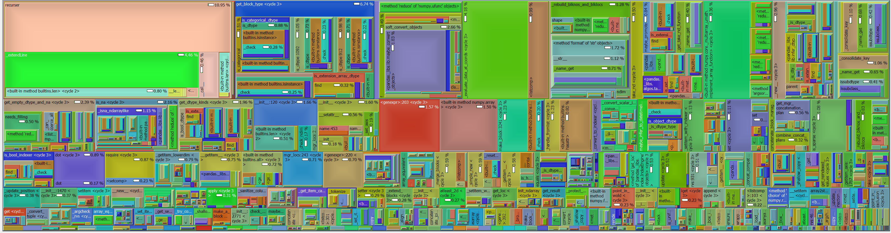

# Fourth_Day

Authors:

1. Martina Karl
2. Stephan Meighen-Berger
3. Li Ruohan
4. Golo Wimmer

## Introduction

A python package to simulate the bioluminescence in the deep sea.
It calculates the light emissions and progates it to a detector.
The detector response and properties can be (rudementarily) modelled
using this code as well.

## Documentation

The package provides automatically generated documentation under
[Documentation](https://meighenbergers.github.io/fourth_day/).

## Emission PDFs

The emission pdfs are constructed from data taken from
*Latz, M.I., Frank, T.M. & Case, J.F.
"Spectral composition of bioluminescence of epipelagic organisms from the Sargasso Sea."
Marine Biology 98, 441-446 (1988) <https://doi.org/10.1007/BF00391120.>*


## Code Example

A basic running example to interface with the package

```python
# Importing the package
from fourth_day import Fourth_Day, config
# Creating fourth day object
fd = Fourth_Day()
# Running the simulation
fd.sim()
# The time array
t = fd.time
# The total emission
data = np.array([np.sum(fd.statistics[i].loc[:, 'photons'].values)
                 for i in range(len(fd.t))])
```

This generates results of the form


For a more in-depth example, use the python notebook example_basics.ipynb in
the examples folder. There you can find additional examples covering most
use cases for the package.

## Code structure

The code is structed as


## Code profile

The most expensive part is the encounter simulation.
For high depths this can be turned off. Generated using
<https://github.com/pwaller/pyprof2calltree/>

