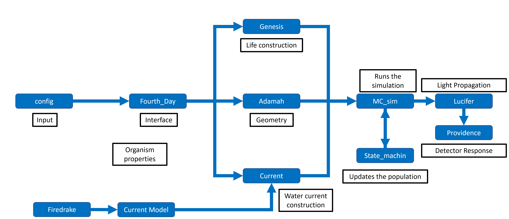

# Fourth_Day

Authors:

1. Martina Karl
2. Stephan Meighen-Berger
3. Golo Wimmer

## Table of contents

[[_TOC_]]

## Introduction

A python package to simulate the bioluminescence in the deep sea.
It calculates the light emissions

## Model

The Model is structed as

## Emission PDFs

The emission pdfs are constructed from data taken from
*Latz, M.I., Frank, T.M. & Case, J.F.
"Spectral composition of bioluminescence of epipelagic organisms from the Sargasso Sea."
Marine Biology 98, 441-446 (1988) https://doi.org/10.1007/BF00391120.*


## Code Example

A basic running example to interface with the package

```python
# Importing the package
import fourth_day as FD
# Importing the config file
import fd_config as config
# Creating fourth day object
contagion = CONTAGION(config=config)
# Running the simulation
fd.sim()
# Results are fetched using
results = fd.results
# The time array
t = results['t']
# The total emission
total = results['total']
```

This generates results of the form


## Code structure

The code is structed as


## TODO

- [] Simulation updates
  - [] Optimize population calculations
  - [] Gradient field calculations
  - [] Incoming organism stream
- [] Code structure updates
  - [] Clean up the interface
- [] Quality of life updates
  - [X] Add requirements.txt
  - [X] Add INSTALL.txt
  - [] Check if installation
  - [] Add writer class for config output
